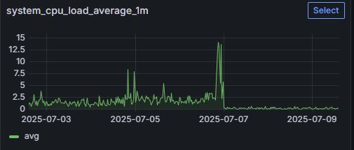
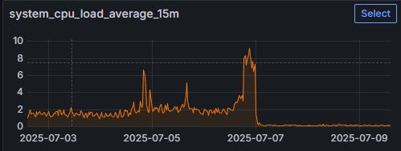
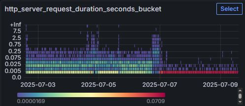
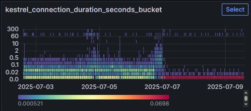
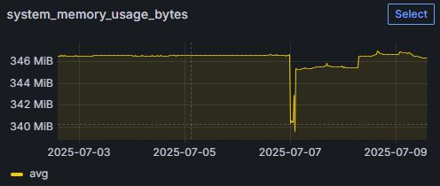

* `инцидент` **[07-06-25] под rsse не мог подняться больше часа**
* `время` 3 часа от обнаружения до восстановления работоспособности
  

* причина: деградация кластера
  * не хватало памяти (постоянная нагрузка от kswapd0, троттлинг от хостера, OOM Killer не срабатывал)
  * устарело ядро
  * протухли сертификаты k3s
  * запросы до kine шли по 3 секунды
  * более 100 рестартов на большинстве системных подов
  * metrics-server утратил работоспособность


* ремонт: 
  * [x] сделал бэкап (kine/k3s-server)
  * [x] включил swap, отключил metrics-server, обновил серты k3s, рестартанул k3s
  * [x] перезагрузил систему для применения апдейтов ядра


* итоги, см. метрики:
  * нагрузка по cpu упала с 10..15 vCPU до 0.1
  * время ответа сервиса сократилось


---
  
  
  
  
  


---
* обдумать и применить:
  * [ ] выставить лимиты
    ```yaml
    resources:
      requests:
        memory: "64Mi"
        cpu: "50m"
      limits:
        memory: "256Mi"
        cpu: "250m"
    ```
  * [ ] перейти на etcd с kine
---
* идеи в процессе разбора:
    * [ ] увеличить initialDelaySeconds: 45(live)/60(ready)
    * [ ] попробовать удалять старый под перед созданием нового
        ```yaml
        spec:
          replicas: 1
          strategy:
            type: Recreate
        ```
